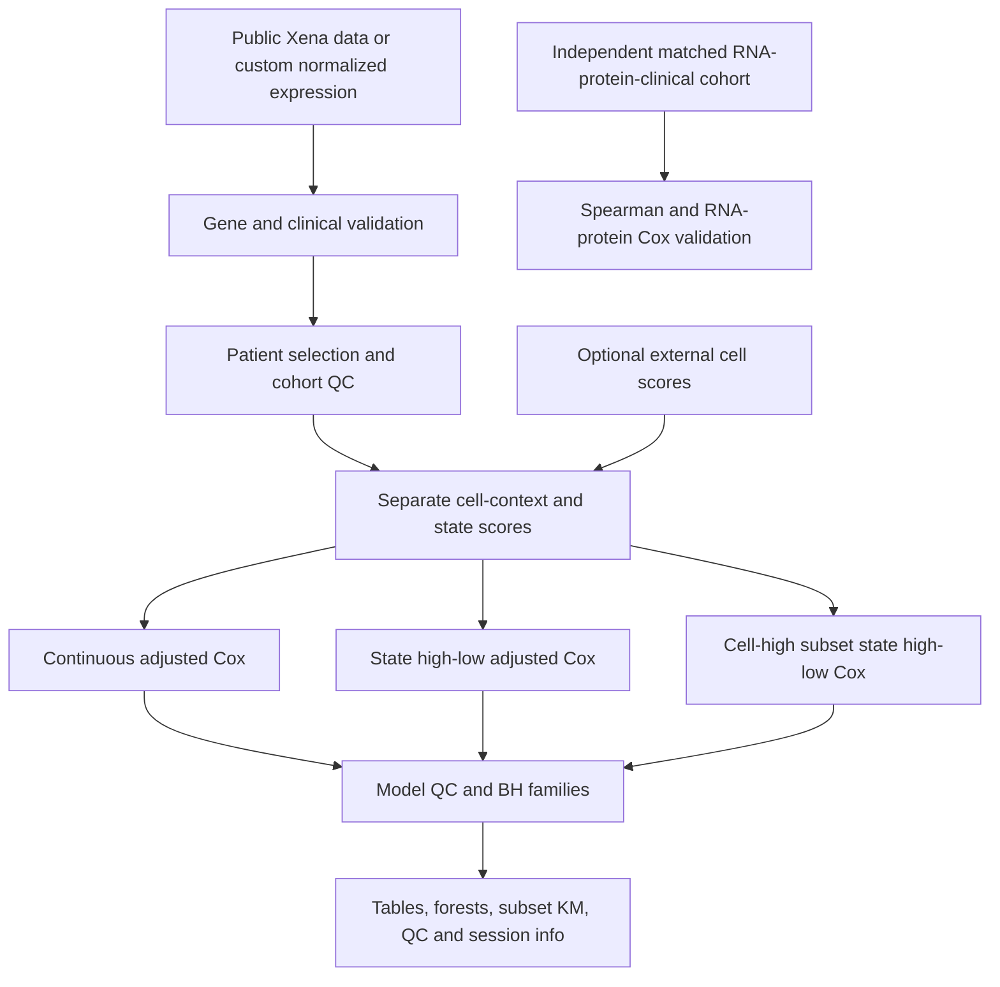

# TCGASigSurvival Methods and Interpretation

## Data and Unit of Analysis

Public TCGA inputs are Xena Toil RSEM gene TPM, Pan-Cancer Atlas OS/clinical
records, TCGA/TARGET/GTEx phenotype metadata, and GENCODE v23 annotation.
Only TCGA tumors enter the default TCGA survival cohorts. The analysis unit
is a patient within a cancer/cohort, after deterministic sample selection.
Primary tumor code 01 is used except SKCM default includes 01 and 06; its
primary-only sensitivity cohort overlaps the default population.

Default Xena expression is already transformed, commonly log2(TPM+0.001).
Legacy preparation retains values inferred to be log-scale; its numeric-range
heuristic is recorded in preparation QC and is not a formal scale detector.
For custom inputs, users declare log or TPM explicitly, with log2(TPM+1)
applied only for TPM. Raw read counts are not a supported direct scoring input.

GENCODE symbols are matched exactly. Duplicate annotated rows per symbol are
collapsed by selecting the row with the highest mean expression (ties by ID).
Custom matrices require unique symbols. Species mapping is not performed.
Uppercase conversion cannot establish orthology or resolve changed aliases.

## Scores

Within cohort c, gene g, patient i:

`z[g,i,c] = (expression[g,i,c] - mean(expression[g,*,c])) / sd(expression[g,*,c])`

Standard deviation uses R's sample SD. Missing values do not enter gene means
and SDs. Constant genes cannot be scored. Modules use equal-weight means of
usable gene z scores. New two-layer analyses enforce the configured minimum
usable gene count for each individual patient. Historical modules enforce
cohort-level usable-gene coverage and average available genes per sample.

`S[i,c] = mean(z[state genes,i,c])`

`C[i,c] = mean(z[cell genes,i,c])`

Both layers are standardized again for continuous Cox terms within complete
analysis samples. Modules are computed on the cohort before complete-case
clinical exclusions; this scoring population is distinct from model fit n.
External numeric cell scores can replace C via exact sample matching.

The historical joint target/signature score is:

`J[i,c] = z(target expression[i,c]) + z(signature mean[i,c])`

The historical signature-only score is the module mean alone. Separate cell
and state scores are not summed in the new two-layer model.

## Survival Models

Overall survival time is in days; event=1 denotes death, event=0 censoring.
Only finite positive times and valid 0/1 events enter the models. Cox models
use the survival package's default Efron handling of ties.

- Continuous two-layer model: `Surv(OS.time, OS.status) ~ state_score_z + cell_score_z + covariates`.
- Adjusted groups: `Surv(OS.time, OS.status) ~ state_high_low + cell_score_z + covariates`.
- Cell-high subset: `Surv(OS.time, OS.status) ~ state_high_low + covariates` among patients with C at or above the cohort median.
- Historical joint/signature-only models: `Surv(OS.time, OS.status) ~ high_low` of the respective score.

State median groups use >= median for high. Optimized groups use > cutoff for
high, with cutoff selected by `survminer::surv_cutpoint(minprop = 0.10)` unless
overridden. The cell-high subset recomputes the state cutoff inside that subset;
the cell threshold itself is the full-analysis-sample median. Cohort scores
are not recomputed using only the cell-high subset.

The full-cohort defaults require >=80 patients and >=20 deaths; subset defaults
are >=40 and >=10. These are screening thresholds, not power guarantees.
Categorical covariates should be appropriately encoded. Missing or infinite
model inputs are excluded. New analysis outputs report excluded n and PH global
p values; a small PH p value motivates a proportional-hazards review rather
than automatic reinterpretation as a valid constant HR.

Cox convergence warnings, absent/nonfinite coefficients and nonpositive or
infinite HR/CI are treated as failures and logged. Failures are excluded from
successful-result multiple-testing calculations. New subset KM curves are
unadjusted descriptive survival curves, even if clinical covariates were used
in the corresponding Cox fit. An annotated Cox p is not a log-rank p.

## Multiplicity and Cutoff Selection

BH is applied separately within each declared family:

| Module | Family |
| --- | --- |
| Historical single target/signature | All successful analyzed cohorts, within cutoff_method |
| New two-layer group comparisons | model x cutoff_method x default_cohort |
| New two-layer continuous state effect | default_cohort, for state effect |
| New two-layer continuous cell effect | default_cohort, separately for cell effect |
| Batch additional batch_FDR | All signatures/cohorts x cutoff_method x default_cohort |
| Matched RNA-protein correlation | Successful cancer correlations |
| Matched proteogenomic survival | predictor x method x adjustment |

Default and overlapping SKCM sensitivity cohorts are separate families in new
modules. BH does not account for optimizing a cutoff using the same survival
outcomes, trying many alternative gene sets, or selectively reporting results.
Use continuous and prespecified median models for primary inference; optimized
cutoffs require independent validation or an explicitly selection-aware design.

## Marker Interpretation

Default Naive CD4 context markers are CD3D, CD3E, TRAC, CD2, CD4, IL7R, CCR7,
TCF7, LEF1, SELL, LTB and MAL. Their expression overlaps with other T-cell and
lymphocyte states. The module is a proxy chosen for the existing workflow;
it is not an independently validated, Naive-CD4-specific abundance estimator.

A state gene set's single-cell origin provides biological provenance but does
not restrict TCGA bulk expression to that cell type. Adjusting a context score
helps model one source of covariation; it does not identify cell-specific state
expression. Gene overlap, score collinearity, stromal/tumor expression and
purity can affect results. Trained immunity is a functional/epigenetic concept;
a derived transcriptional score alone does not establish it mechanistically.

## Proteogenomic Validation

Native matching uses exact cancer_type + patient_id, rejects duplicates and
joins RNA/protein by intersection, then adds clinical data by left join.
ID normalization, cross-study matching and assay harmonization must be resolved
before calling the function. Users must verify that keys identify the same
patient/sample and that measurements are comparable within each cohort.

Spearman correlations use complete finite pairs and asymptotic p values
(`exact = FALSE`), without bootstrap confidence intervals. RNA and protein
survival effects are computed independently on each model's complete cases,
using standardized continuous expression or a median high/low split. Optional
signature_score adjustment and clinical adjustment are explicit. These models
are not identical to the historical TCGA summed target/signature score.

TCGA/CPTAC cohort comparison is external replication, not patient-level merging.
The legacy CPTAC loader can summarize pre-existing external analysis outputs;
its optional rerun requires a separately deployed external pipeline. This
package does not automatically download all CPTAC studies or infer missing
cohort relationships.

## Workflow

## Sources and Reporting

- [UCSC Xena](https://xena.ucsc.edu/) and [Toil data hub](https://toil.xenahubs.net/).
- [Pan-Cancer Atlas hub](https://pancanatlas.xenahubs.net/).
- [GENCODE human release 23](https://www.gencodegenes.org/human/release_23.html).
- [TCGA clinical resource paper](https://doi.org/10.1016/j.cell.2018.02.052).
- [Toil expression resource paper](https://doi.org/10.1038/nbt.3772).
- [survival package](https://cran.r-project.org/package=survival).
- [survminer cutoff documentation](https://rpkgs.datanovia.com/survminer/reference/surv_cutpoint.html).

Report software version, signature provenance/species/direction, input snapshot
and fingerprints, expression scale, cohort/sample rules, patient/death counts,
coverage/exclusions, cutoffs, clinical covariates, HR/95% CI/P/FDR, families,
PH review and all failed cohorts. Neither these analyses nor their figures
establish causality, cell-intrinsic biology or a clinical prediction model.
